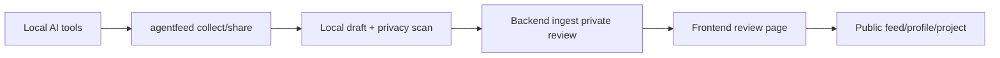

# AgentFeed CLI MOC

## 제품 역할

AgentFeed는 AI agent가 수행한 개발 작업을 로컬에서 수집하고, private review draft로 업로드한 뒤, 사용자가 검토하여 public feed/worklog/project/profile로 공유하는 제품이다.

## 핵심 문서

- [[AgentFeed Current Product Brief]]
- [[Integration - CLI Backend Frontend]]
- [[Collection System]]
- [[Auth & Credential Safety]]
- [[Privacy Safety]]
- [[Runtime Configuration]]
- [[Active Tasks]]
- [[Human Action Checklist]]

## 현재 레포 책임

| Repo | Branch | 책임 |
| --- | --- | --- |
| [[AgentFeed Current Product Brief#CLI]] | `main` | npm CLI, local draft, credential storage, AI session/git/test evidence 수집, upload/share/open |
| [[AgentFeed Current Product Brief#Backend]] | `master` | FastAPI API, auth/session/token, ingest, feed/worklog/project/social/moderation, quotas, readiness |
| [[AgentFeed Current Product Brief#Frontend]] | `main` | Next.js app, login/authorize, review/publish, feed/explore/dashboard/settings/profile/projects |
| [[Runtime Configuration#Dev orchestration]] | `main` | local docker/native stack, cross-repo contract/e2e/hosted/commercial readiness gates |

## 현재 가장 중요한 정책

1. `agentfeed share` / `agentfeed collect --upload` / `agentfeed publish`는 terminal review 후 `yes` 입력 또는 명시적 `--yes` 전에는 서버 업로드가 일어나지 않는다.
2. Browser login은 URL에 token을 노출하지 않고, CLI가 approval session을 exchange한다.
3. Private review URL은 Backend metadata `review_base_url` 또는 명시 allowlist와 일치해야 열린다.
4. 개발 단계에서는 개인 서버 IP-only로 server smoke를 할 수 있다.
5. Hosted/commercial readiness는 실제 HTTPS public URL 입력이 필수다. `agentfeed.dev`는 준비된 도메인이 아니다.
6. Commercial readiness는 local cross-repo gate + hosted smoke + browser smoke + OAuth live evidence가 모두 필요하다.
7. 실제 배포 전 owner가 처리할 항목은 [[Human Action Checklist]]를 기준으로 한다.

## 삭제/통합된 이전 문서

개별 `Commercial Readiness Hardening - ...` 작업 로그 250여 개는 [[Commercial Readiness Completed Summary 2026-06-04]]로 통합했다.
