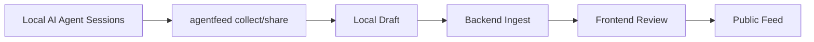

# AgentFeed CLI MOC

## 제품 역할

AgentFeed CLI는 로컬 AI 에이전트 작업 증거를 수집하고, privacy-safe worklog draft로 만든 뒤, Backend/Frontend review flow로 넘기는 게이트웨이입니다.

## 핵심 노트

- [[Collection System]]
- [[Privacy Safety]]
- [[Integration - CLI Backend Frontend]]
- [[Active Tasks]]

## 원본 문서

- [[AgentFeed CLI README]]
- [[AgentFeed Local CLI MVP Spec v0.2]]
- [[CLI Product Improvements Roadmap]]
- [[Cross Repo Integration Fixes]]

## 주요 개념 링크

- [[Collection System#수집 품질 원칙|수집 품질 원칙]]
- [[Collection System#증거 소스|증거 소스]]
- [[Privacy Safety#Redaction dry-run UX|Redaction dry-run UX]]
- [[Integration - CLI Backend Frontend#End-to-end 흐름|End-to-end 흐름]]
- [[Active Tasks#P1 후보|P1 후보]]
