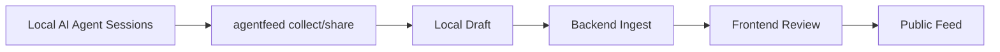

# AgentFeed CLI MOC

## 제품 역할

AgentFeed CLI는 로컬 AI 에이전트 작업 증거를 수집하고, privacy-safe worklog draft로 만든 뒤, Backend/Frontend review flow로 넘기는 게이트웨이입니다.

## 문서 운영 원칙

> [!important]
> 앞으로 구현/분석/검증 문서는 `obsidian-vault/`에 Obsidian Markdown 형식으로 작성합니다. 신규 작업 노트는 MOC, 관련 Area note, [[Active Tasks]]에 wikilink로 연결합니다.

## 핵심 노트

- [[Commercial Readiness Hardening - OpenAPI Request Body and Schema Contract Gate 2026-06-02]] — OpenAPI request body/schema type-required-nullability drift gate

- [[Commercial Readiness Hardening - Audit Trail CI Fail Closed and Supply Chain Gate 2026-06-02]] — Backend audit events, Frontend CI API config fail-closed, CLI full supply-chain/release gate

- [[Commercial Readiness Hardening - Public Timeline Settings and URL Privacy 2026-06-02]] — CLI sensitive URL scan, backend public timeline scan, frontend settings/public project adapter

- [[Commercial Readiness Hardening - CLI Approval Code Privacy Fallback and Public Adapter 2026-06-02]] — CLI approval code, backend fallback re-scan, frontend public adapter, release/env/privacy guardrails

- [[Commercial Readiness Hardening - OAuth Contract Smoke and Action Pinning 2026-06-02]] — automated OAuth callback/session exchange smoke and cross-repo Actions SHA pin gate

- [[Commercial Readiness Hardening - Hosted OAuth Live Smoke Harness 2026-06-02]]

- [[Commercial Readiness Hardening - Live Share Hydrated Smoke Revalidation 2026-06-02]]

- [[Commercial Readiness Hardening - Backend OAuth Username and Model Privacy Scan 2026-06-01]]

- [[Commercial Readiness Hardening - CLI Upload Cache and CI Login Guard 2026-06-01]]

- [[Commercial Readiness Hardening - CLI Release Tag Version Gate 2026-06-01]]

- [[Commercial Readiness Hardening - CLI Auth URL Minimization and Production DB TLS 2026-06-01]]

- [[Commercial Readiness Hardening - CLI Diagnostics Backend Privacy Rescan and Feed Backdrop 2026-06-01]]

- [[Commercial Readiness Hardening - Frontend API Timeout and Auth Recovery 2026-06-01]]

- [[Commercial Readiness Hardening - Release Supply Chain and API Security Headers 2026-06-01]]

- [[Commercial Readiness Hardening - Backend Public URL Resolution Safety 2026-06-01]]

- [[Commercial Readiness Hardening - Dev Smoke Package Entrypoint 2026-06-01]]

- [[Commercial Readiness Hardening - Test Metrics Activity Range OAuth Timeout and Notification Feedback 2026-06-01]]

- [[Commercial Readiness Hardening - Frontend Static Mock Data Removal 2026-06-01]]

- [[Commercial Readiness Hardening - CLI Codex Parallel Tool Collection 2026-06-01]]

- [[Commercial Readiness Hardening - Remote CI Environment Recovery 2026-06-01]]

- [[Commercial Readiness Hardening - Production Config Private Host and CI Env Gates 2026-06-01]]

- [[Commercial Readiness Hardening - Frontend Signout Click Smoke 2026-06-01]]

- [[Commercial Readiness Hardening - Session Logout Revocation Smoke 2026-06-01]]

- [[Commercial Readiness Hardening - Authenticated Frontend Account Smoke 2026-06-01]]

- [[Commercial Readiness Hardening - Frontend Project Route Dev Runtime 2026-06-01]]

- [[Commercial Readiness Hardening - Readiness Probe Semantics 2026-06-01]]

- [[Commercial Readiness Hardening - Frontend Native Profile Navigation Links 2026-06-01]]

- [[Commercial Readiness Hardening - Frontend Worklog Card Semantic Controls 2026-06-01]]

- [[Commercial Readiness Hardening - Frontend Auth Recovery and Notification Actions 2026-06-01]]

- [[Commercial Readiness Hardening - Frontend Feed Sidebar Accessibility 2026-06-01]]

- [[Commercial Readiness Hardening - CLI Review URL Handoff Failure Surface 2026-06-01]]

- [[Commercial Readiness Hardening - Settings Review Cookie and Command Wrapper Safety 2026-06-01]]

- [[Commercial Readiness Hardening - Backend OAuth Next and Frontend Empty OK Responses 2026-06-01]]

- [[Commercial Readiness Hardening - Frontend Worklog Detail Social Stats Soft Fail 2026-06-01]]

- [[Commercial Readiness Hardening - Frontend External URL IPv6 Safety 2026-06-01]]

- [[Commercial Readiness Hardening - Backend Rate Limit Store Fail Closed 2026-06-01]]

- [[Commercial Readiness Hardening - Frontend Dynamic Auth Next Query Allowlist 2026-06-01]]

- [[Commercial Readiness Hardening - Frontend Worklog Detail Retry Safety 2026-06-01]]

- [[Commercial Readiness Hardening - CLI Project Bound Session Discovery 2026-06-01]]

- [[Commercial Readiness Hardening - Backend Environment Fail Fast 2026-06-01]]

- [[Commercial Readiness Hardening - Frontend Auth Expiry Social Cleanup 2026-06-01]]

- [[Commercial Readiness Hardening - Frontend CSP Style Inline Hardening 2026-06-01]]

- [[Commercial Readiness Hardening - CLI Credential Fallback Fail Closed 2026-06-01]]

- [[Commercial Readiness Hardening - Settings Token Revoke Confirmation 2026-06-01]]

- [[Commercial Readiness Hardening - Frontend Detail Profile Leaderboard Accessibility 2026-06-01]]

- [[Commercial Readiness Hardening - Frontend Accessibility and CLI Login Timeout Polling 2026-06-01]]

- [[Commercial Readiness Hardening - CLI Trusted Publishing Enforcement 2026-06-01]]

- [[Commercial Readiness Hardening - CLI Upload Timeout Reconciliation 2026-06-01]]

- [[Commercial Readiness Hardening - Frontend Interaction Pending Guards 2026-06-01]]

- [[Commercial Readiness Hardening - Backend Request ID Observability 2026-06-01]]

- [[Commercial Readiness Hardening - Frontend CSP and Backend Readiness 2026-06-01]]

- [[Commercial Readiness Hardening - Cross Repo CI Gates 2026-06-01]]

- [[Commercial Readiness Hardening - CLI Release Preflight and Provenance 2026-06-01]]

- [[Commercial Readiness Hardening - Compose Health Readiness 2026-06-01]]

- [[Commercial Readiness Hardening - Feed Search Retry UX 2026-06-01]]

- [[Commercial Readiness Hardening - Landing API Backed Preview 2026-06-01]]

- [[Commercial Readiness Hardening - Worklog Author Mock Fallback Removal 2026-06-01]]

- [[Commercial Readiness Hardening - Feed Tag Filter Contract 2026-06-01]]

- [[Commercial Readiness Hardening - CLI NPM Package Metadata 2026-06-01]]

- [[Commercial Readiness Hardening - Project Clear Smoke Gate 2026-06-01]]

- [[Commercial Readiness Hardening - Project Nullable Field Clear Semantics 2026-06-01]]

- [[Commercial Readiness Hardening - Project Mutation Surface 2026-06-01]]

- [[Commercial Readiness Hardening - Public Activity Tab 2026-06-01]]

- [[Commercial Readiness Hardening - Report Actions Surface 2026-06-01]]

- [[Commercial Readiness Hardening - Profile Username Settings Surface 2026-05-31]]

- [[Commercial Readiness Hardening - Cross Repo OpenAPI Contract Gate 2026-05-31]]

- [[Commercial Readiness Hardening - Full JSON API Response Contract 2026-05-31]]

- [[Commercial Readiness Hardening - User Dashboard Worklog Contracts and Collect JSON Stability 2026-05-31]]

- [[Commercial Readiness Hardening - Public Interaction Response Models 2026-05-31]]

- [[Commercial Readiness Hardening - Auth Identity Response Models and JSON Side Effects 2026-05-31]]

- [[Commercial Readiness Hardening - Rate Limit Fallback Detail Payload Resilience and Credential Fallback Warning 2026-05-31]]

- [[Commercial Readiness Hardening - OAuth Cookie Scope JSON Upload and Signout State 2026-05-31]]

- [[Commercial Readiness Hardening - Browser Approved Token Rotation 2026-05-31]]

- [[Commercial Readiness Hardening - Profile Follow Hydration and Leaderboard Resilience 2026-05-31]]

- [[Commercial Readiness Hardening - Rate Limit and Privacy Finding Ownership 2026-05-31]]

- [[Commercial Readiness Hardening - Settings Privacy Controls 2026-05-31]]

- [[Commercial Readiness Hardening - CLI Privacy Scanner Header and URL Redaction 2026-05-31]]

- [[Commercial Readiness Hardening - CLI Command and Token Trust Boundary 2026-05-31]]

- [[Commercial Readiness Audit Followups 2026-05-31]]

- [[Commercial Readiness Hardening - Settings Named Token Creation 2026-05-31]]

- [[Commercial Readiness Hardening - Dashboard Recent Worklog Actions 2026-05-31]]

- [[Commercial Readiness Hardening - Ingest Repository URL Safety 2026-05-31]]

- [[Commercial Readiness Hardening - CLI Token Stdin Login 2026-05-31]]

- [[Commercial Readiness Hardening - Owner Aware Project Routes 2026-05-31]]

- [[Commercial Readiness Hardening - Smoke User Note Privacy Contract 2026-05-31]]

- [[Commercial Readiness Hardening - Publish Privacy Severity Auth Smoke and Alembic Version Gate 2026-05-31]]

- [[Commercial Readiness Hardening - Hydrated Browser Privacy Smoke 2026-05-31]]

- [[Commercial Readiness Hardening - CLI Draft Artifact Permissions 2026-05-31]]

- [[Commercial Readiness Hardening - CLI Private Review Privacy Policy 2026-05-31]]

- [[Commercial Readiness Hardening - Feed Keyset and OAuth Hash Redirect 2026-05-31]]

- [[Commercial Readiness Hardening - Cross Platform Open Config Validation and Settings Partial Failure 2026-05-31]]

- [[Commercial Readiness Hardening - Concurrent Notification Migration CLI Auth Smoke and Header Contracts 2026-05-31]]
- [[Commercial Readiness Hardening - Native Keychain Smoke Notification Gates and Social Action Contracts 2026-05-31]]
- [[Commercial Readiness Hardening - Session Parser Bounds Notification Dedupe and Comment Contracts 2026-05-31]]
- [[Commercial Readiness Hardening - Keychain Publish Race Leaderboard Scale and Frontend Contracts 2026-05-31]]

- [[Commercial Readiness Audit 2026-05-30]]
- [[Commercial Readiness Hardening - Release and Public Gates 2026-05-30]]
- [[Commercial Readiness Hardening - Auth Race and Login Smoke 2026-05-30]]
- [[Commercial Readiness Hardening - Auth Maintenance and Rendered Smoke 2026-05-30]]
- [[Commercial Readiness Hardening - Token Quotas Privacy Tags and Card Actions 2026-05-30]]
- [[Commercial Readiness Hardening - Comment Capability and Theme Hydration 2026-05-30]]
- [[Commercial Readiness Hardening - Card Capabilities Rate Limits and Dry Run Safety 2026-05-30]]

- [[Commercial Readiness Hardening - Token Expiry Provenance and Feed UX 2026-05-30]]
- [[Commercial Readiness Hardening - Token Lifecycle and Settings Surface 2026-05-30]]
- [[Commercial Readiness Hardening - Token Rotation UX 2026-05-30]]
- [[Commercial Readiness Hardening - CSRF Token Capture and Search Pagination 2026-05-30]]
- [[Runtime Configuration#2026-05-30 Environment token rotation remediation|Env token rotation remediation]]
- [[Integration - CLI Backend Frontend#2026-05-30 Project slug uniqueness and race safety|Project slug race safety]]
- [[Integration - CLI Backend Frontend#2026-05-30 Leaderboard cursor pagination contract|Leaderboard cursor pagination]]
- [[Commercial Readiness Hardening - Leaderboard Pagination Slug Uniqueness Env Token UX 2026-05-30]]
- [[Collection System]]
- [[Privacy Safety]]
- [[Auth & Credential Safety]]
- [[Runtime Configuration]]
- [[Integration - CLI Backend Frontend]]
- [[Active Tasks]]

## 원본 문서

- [[AgentFeed CLI README]]
- [[AgentFeed Local CLI MVP Spec v0.2]]
- [[CLI Product Improvements Roadmap]]
- [[Cross Repo Integration Fixes]]

## 주요 개념 링크

- [[Auth & Credential Safety#2026-05-31 Browser-approved ingestion token rotation|Browser-approved token rotation]]

- [[Integration - CLI Backend Frontend#2026-05-31 Profile follow hydration and leaderboard resilience|Profile follow hydration + leaderboard resilience]]

- [[Auth & Credential Safety#2026-05-31 Public and ingest IP-based rate-limit identity|Public and ingest IP-based rate-limit identity]]
- [[Privacy Safety#2026-05-31 Server-owned privacy finding resolution|Server-owned privacy finding resolution]]

- [[Integration - CLI Backend Frontend#2026-05-31 Settings privacy controls|Settings privacy controls]]
- [[Privacy Safety#2026-05-31 Settings privacy controls|Settings privacy controls]]

- [[Privacy Safety#2026-05-31 Header and URL privacy scanner expansion|Header and URL privacy scanner expansion]]

- [[Collection System#2026-05-31 Configured command trust boundary|Configured command trust boundary]]
- [[Auth & Credential Safety#2026-05-31 Literal argv token guard|Literal argv token guard]]

- [[Auth & Credential Safety#2026-05-31 OAuth next hash preservation|OAuth next hash preservation]]
- [[Integration - CLI Backend Frontend#2026-05-31 Aggregate feed keyset and OAuth hash redirect|Aggregate feed keyset + OAuth hash redirect]]

- [[Auth & Credential Safety#2026-05-31 Cross-platform browser opener and open command trust|Cross-platform opener + open trust]]
- [[Runtime Configuration#2026-05-31 Backend host and proxy config fail-fast|Backend host/proxy config fail-fast]]
- [[Integration - CLI Backend Frontend#2026-05-31 Settings partial failure and cross-platform open contracts|Settings partial failure + open contracts]]

- [[Collection System#수집 품질 원칙|수집 품질 원칙]]
- [[Collection System#증거 소스|증거 소스]]
- [[Privacy Safety#Redaction dry-run UX|Redaction dry-run UX]]
- [[Auth & Credential Safety#2026-05-30 CLI ephemeral login --no-save|CLI ephemeral login]]
- [[Auth & Credential Safety#2026-05-30 GitHub OAuth state CSRF protection|GitHub OAuth state]]
- [[Auth & Credential Safety#2026-05-30 Deleted user ingestion-token invalidation|Deleted user token invalidation]]
- [[Auth & Credential Safety#2026-05-30 CLI auth exchange active-user gate|CLI auth exchange gate]]
- [[Runtime Configuration#2026-05-30 Frontend API URL normalization|Frontend API URL normalization]]
- [[Runtime Configuration#2026-05-30 Frontend production API env preflight|Frontend production API preflight]]
- [[Runtime Configuration#2026-05-30 CLI API POST timeout|CLI API POST timeout]]
- [[Integration - CLI Backend Frontend#2026-05-30 Worklog project ownership gate|Worklog project ownership gate]]
- [[Auth & Credential Safety#2026-05-30 CLI credential file permissions|CLI credential permissions]]
- [[Integration - CLI Backend Frontend#2026-05-30 CLI npm prepack release gate|CLI npm prepack gate]]
- [[Integration - CLI Backend Frontend#2026-05-30 Backend streamed ingest payload cap|Backend ingest payload cap]]
- [[Integration - CLI Backend Frontend#2026-05-30 Frontend project slug fallback|Frontend project slug fallback]]
- [[Privacy Safety#2026-05-30 Windows path redaction|Windows path redaction]]
- [[Integration - CLI Backend Frontend#2026-05-30 CLI open-review config 계약|CLI open-review config]]
- [[Integration - CLI Backend Frontend#2026-05-30 Worklog comment visibility gate|Comment visibility gate]]
- [[Integration - CLI Backend Frontend#2026-05-30 Unlisted publish privacy gate|Unlisted publish privacy gate]]
- [[Integration - CLI Backend Frontend#2026-05-30 GitHub OAuth provider failure contract|GitHub OAuth provider 503]]
- [[Integration - CLI Backend Frontend#2026-05-30 CLI duplicate ingest 409 재동기화|CLI duplicate ingest resync]]
- [[Integration - CLI Backend Frontend#2026-05-30 Frontend settings/token surface|Frontend settings/token surface]]
- [[Integration - CLI Backend Frontend#2026-05-30 Token rotation end-to-end contract|Token rotation E2E]]
- [[Auth & Credential Safety#2026-05-30 Cookie-authenticated mutation Origin gate|Cookie mutation Origin gate]]
- [[Auth & Credential Safety#2026-05-30 One-time rotated token capture UX|Rotated token capture UX]]
- [[Integration - CLI Backend Frontend#2026-05-30 Search cursor pagination contract|Search cursor pagination]]
- [[Runtime Configuration#2026-05-30 CLI invalid token recovery hint|CLI invalid token recovery]]
- [[Runtime Configuration#2026-05-30 CLI token expiry visibility|CLI token expiry visibility]]
- [[Runtime Configuration#2026-05-30 CLI token rotation command|CLI token rotation command]]
- [[Auth & Credential Safety#2026-05-30 Ingestion token lifecycle status|Ingestion token lifecycle status]]
- [[Auth & Credential Safety#2026-05-30 Ingestion token rotation contract|Ingestion token rotation contract]]
- [[Integration - CLI Backend Frontend#2026-05-30 Frontend unpublish control predicate|Frontend unpublish predicate]]
- [[Auth & Credential Safety#2026-05-30 OAuth state payload expiry|OAuth state expiry]]
- [[Privacy Safety#2026-05-30 Social mutation visibility gate|Social mutation visibility gate]]
- [[Integration - CLI Backend Frontend#2026-05-30 CLI hook uninstall no-op|CLI hook uninstall no-op]]
- [[Integration - CLI Backend Frontend#2026-05-30 Frontend comment submit lock|Frontend comment submit lock]]
- [[Privacy Safety#2026-05-30 CLI draft id path safety|CLI draft id path safety]]
- [[Privacy Safety#2026-05-30 Private comment report visibility gate|Private comment report gate]]
- [[Auth & Credential Safety#2026-05-30 Header OAuth next preservation|Header OAuth next]]
- [[Integration - CLI Backend Frontend#2026-05-30 Publish follower notification producer|Publish follower notifications]]
- [[Integration - CLI Backend Frontend#2026-05-30 CLI integration test build lock|CLI integration test build lock]]
- [[Integration - CLI Backend Frontend#2026-05-30 CLI git-only duplicate test isolation|CLI git-only duplicate test isolation]]
- [[Privacy Safety#2026-05-30 Public surface published-status gate|Public published-status gate]]
- [[Integration - CLI Backend Frontend#2026-05-30 Frontend nullable array adapter hardening|Frontend nullable arrays]]
- [[Privacy Safety#2026-05-30 Comment settings enforcement|Comment settings enforcement]]
- [[Privacy Safety#2026-05-30 Soft-deleted project metadata gate|Soft-deleted project metadata gate]]
- [[Privacy Safety#2026-05-30 Public metric privacy settings|Public metric privacy settings]]
- [[Auth & Credential Safety#2026-05-30 Backend critical path rate-limit|Backend rate-limit]]
- [[Auth & Credential Safety#2026-05-30 Frontend OAuth next allowlist|Frontend OAuth next allowlist]]
- [[Runtime Configuration#2026-05-30 Runtime API config failure UI|Runtime API config failure UI]]
- [[Integration - CLI Backend Frontend#2026-05-30 Frontend social mutation pending lock|Social mutation pending lock]]
- [[Integration - CLI Backend Frontend#2026-05-30 Worklog card can_comment propagation|Card can_comment propagation]]
- [[Integration - CLI Backend Frontend#2026-05-30 Unauthenticated social action guard|Unauthenticated social guard]]
- [[Auth & Credential Safety#2026-05-30 Worklog and project mutation rate-limit coverage|Mutation rate-limit coverage]]
- [[Auth & Credential Safety#2026-05-31 Native macOS keychain smoke|Native macOS keychain smoke]]
- [[Auth & Credential Safety#2026-05-31 CLI auth smoke and CI guard|CLI auth smoke + CI guard]]
- [[Integration - CLI Backend Frontend#2026-05-31 Concurrent notification migration and Header contracts|Concurrent migration + Header contracts]]
- [[Integration - CLI Backend Frontend#2026-05-31 Notification settings gate and social action contracts|Notification gate + social action contracts]]
- [[Collection System#2026-05-31 Session parser bounded input guard|Session parser bounds]]
- [[Integration - CLI Backend Frontend#2026-05-31 Notification dedupe and frontend comment contracts|Notification dedupe + comment contracts]]
- [[Collection System#2026-05-30 share dry-run command execution guard|share dry-run command guard]]
- [[Integration - CLI Backend Frontend#End-to-end 흐름|End-to-end 흐름]]
- [[Active Tasks#P1 후보|P1 후보]]
