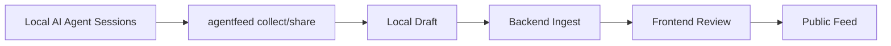

# AgentFeed CLI MOC

## 제품 역할

AgentFeed CLI는 로컬 AI 에이전트 작업 증거를 수집하고, privacy-safe worklog draft로 만든 뒤, Backend/Frontend review flow로 넘기는 게이트웨이입니다.

## 핵심 노트

- [[Commercial Readiness Audit 2026-05-30]]
- [[Commercial Readiness Hardening - Release and Public Gates 2026-05-30]]
- [[Commercial Readiness Hardening - Auth Race and Login Smoke 2026-05-30]]
- [[Commercial Readiness Hardening - Auth Maintenance and Rendered Smoke 2026-05-30]]
- [[Commercial Readiness Hardening - Token Quotas Privacy Tags and Card Actions 2026-05-30]]
- [[Commercial Readiness Hardening - Comment Capability and Theme Hydration 2026-05-30]]

- [[Collection System]]
- [[Privacy Safety]]
- [[Auth & Credential Safety]]
- [[Runtime Configuration]]
- [[Integration - CLI Backend Frontend]]
- [[Active Tasks]]

## 원본 문서

- [[AgentFeed CLI README]]
- [[AgentFeed Local CLI MVP Spec v0.2]]
- [[CLI Product Improvements Roadmap]]
- [[Cross Repo Integration Fixes]]

## 주요 개념 링크

- [[Collection System#수집 품질 원칙|수집 품질 원칙]]
- [[Collection System#증거 소스|증거 소스]]
- [[Privacy Safety#Redaction dry-run UX|Redaction dry-run UX]]
- [[Auth & Credential Safety#2026-05-30 CLI ephemeral login --no-save|CLI ephemeral login]]
- [[Auth & Credential Safety#2026-05-30 GitHub OAuth state CSRF protection|GitHub OAuth state]]
- [[Auth & Credential Safety#2026-05-30 Deleted user ingestion-token invalidation|Deleted user token invalidation]]
- [[Auth & Credential Safety#2026-05-30 CLI auth exchange active-user gate|CLI auth exchange gate]]
- [[Runtime Configuration#2026-05-30 Frontend API URL normalization|Frontend API URL normalization]]
- [[Runtime Configuration#2026-05-30 Frontend production API env preflight|Frontend production API preflight]]
- [[Runtime Configuration#2026-05-30 CLI API POST timeout|CLI API POST timeout]]
- [[Integration - CLI Backend Frontend#2026-05-30 Worklog project ownership gate|Worklog project ownership gate]]
- [[Auth & Credential Safety#2026-05-30 CLI credential file permissions|CLI credential permissions]]
- [[Integration - CLI Backend Frontend#2026-05-30 CLI npm prepack release gate|CLI npm prepack gate]]
- [[Integration - CLI Backend Frontend#2026-05-30 Backend streamed ingest payload cap|Backend ingest payload cap]]
- [[Integration - CLI Backend Frontend#2026-05-30 Frontend project slug fallback|Frontend project slug fallback]]
- [[Privacy Safety#2026-05-30 Windows path redaction|Windows path redaction]]
- [[Integration - CLI Backend Frontend#2026-05-30 CLI open-review config 계약|CLI open-review config]]
- [[Integration - CLI Backend Frontend#2026-05-30 Worklog comment visibility gate|Comment visibility gate]]
- [[Integration - CLI Backend Frontend#2026-05-30 Unlisted publish privacy gate|Unlisted publish privacy gate]]
- [[Integration - CLI Backend Frontend#2026-05-30 GitHub OAuth provider failure contract|GitHub OAuth provider 503]]
- [[Integration - CLI Backend Frontend#2026-05-30 CLI duplicate ingest 409 재동기화|CLI duplicate ingest resync]]
- [[Integration - CLI Backend Frontend#2026-05-30 Frontend unpublish control predicate|Frontend unpublish predicate]]
- [[Auth & Credential Safety#2026-05-30 OAuth state payload expiry|OAuth state expiry]]
- [[Privacy Safety#2026-05-30 Social mutation visibility gate|Social mutation visibility gate]]
- [[Integration - CLI Backend Frontend#2026-05-30 CLI hook uninstall no-op|CLI hook uninstall no-op]]
- [[Integration - CLI Backend Frontend#2026-05-30 Frontend comment submit lock|Frontend comment submit lock]]
- [[Privacy Safety#2026-05-30 CLI draft id path safety|CLI draft id path safety]]
- [[Privacy Safety#2026-05-30 Private comment report visibility gate|Private comment report gate]]
- [[Auth & Credential Safety#2026-05-30 Header OAuth next preservation|Header OAuth next]]
- [[Integration - CLI Backend Frontend#2026-05-30 Publish follower notification producer|Publish follower notifications]]
- [[Integration - CLI Backend Frontend#2026-05-30 CLI integration test build lock|CLI integration test build lock]]
- [[Integration - CLI Backend Frontend#2026-05-30 CLI git-only duplicate test isolation|CLI git-only duplicate test isolation]]
- [[Privacy Safety#2026-05-30 Public surface published-status gate|Public published-status gate]]
- [[Integration - CLI Backend Frontend#2026-05-30 Frontend nullable array adapter hardening|Frontend nullable arrays]]
- [[Privacy Safety#2026-05-30 Comment settings enforcement|Comment settings enforcement]]
- [[Privacy Safety#2026-05-30 Soft-deleted project metadata gate|Soft-deleted project metadata gate]]
- [[Privacy Safety#2026-05-30 Public metric privacy settings|Public metric privacy settings]]
- [[Auth & Credential Safety#2026-05-30 Backend critical path rate-limit|Backend rate-limit]]
- [[Auth & Credential Safety#2026-05-30 Frontend OAuth next allowlist|Frontend OAuth next allowlist]]
- [[Runtime Configuration#2026-05-30 Runtime API config failure UI|Runtime API config failure UI]]
- [[Integration - CLI Backend Frontend#2026-05-30 Frontend social mutation pending lock|Social mutation pending lock]]
- [[Integration - CLI Backend Frontend#End-to-end 흐름|End-to-end 흐름]]
- [[Active Tasks#P1 후보|P1 후보]]
