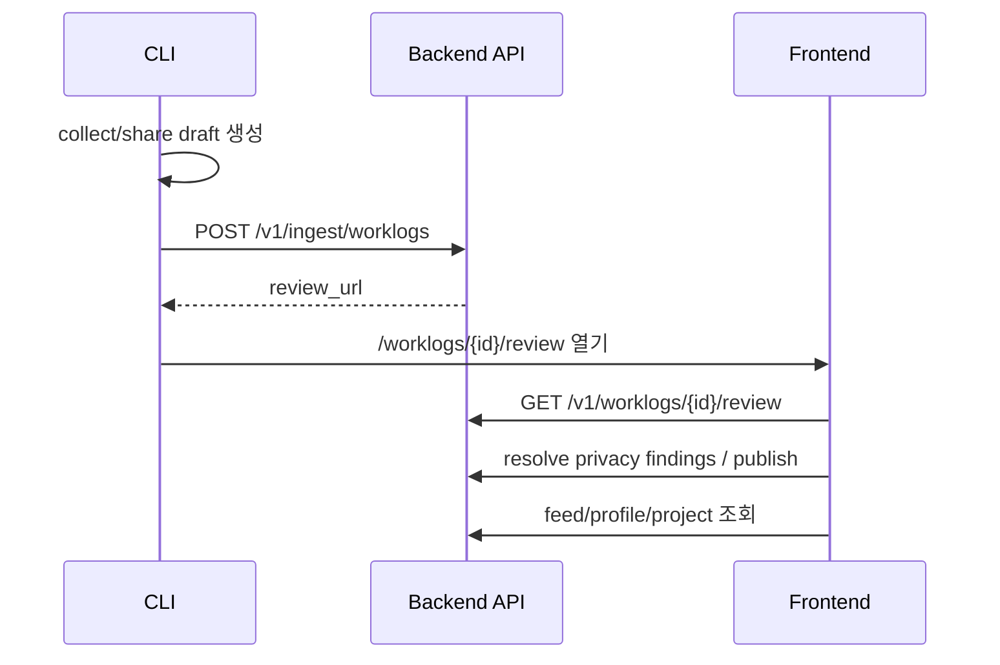

# Integration - CLI Backend Frontend

## End-to-end 흐름

## 계약 기준

> [!important]
> 파라미터 충돌이 있으면 **Database column name → Backend → Frontend → CLI** 순서로 맞춥니다.

## 완료된 큰 축

- review URL route 정합성
- OAuth callback/dashboard route 정합성
- ingest source metadata 보존
- duplicate ingest idempotency
- feed/project/leaderboard/social API mock 제거 및 실 API 연결
- collection window reason review evidence 노출

## 관련 원본

- [[Cross Repo Integration Fixes#목표 end-to-end 흐름]]
- [[Cross Repo Integration Fixes#P1 — API contract drift 수정]]
- [[Cross Repo Integration Fixes#P2 — 제품 완성도]]

## 남은 검증 리스크

> [!warning]
> Docker daemon이 꺼져 있으면 `make smoke-e2e` 성공 경로는 로컬에서 재검증할 수 없습니다.

- [ ] Docker Desktop 실행 상태에서 `agentfeed-dev`의 `make smoke-e2e` 성공 확인
- [ ] 실제 GitHub OAuth / CLI browser login happy path 재확인
- [ ] 실제 사용자 작업 repo에서 `agentfeed share --open-review` smoke
