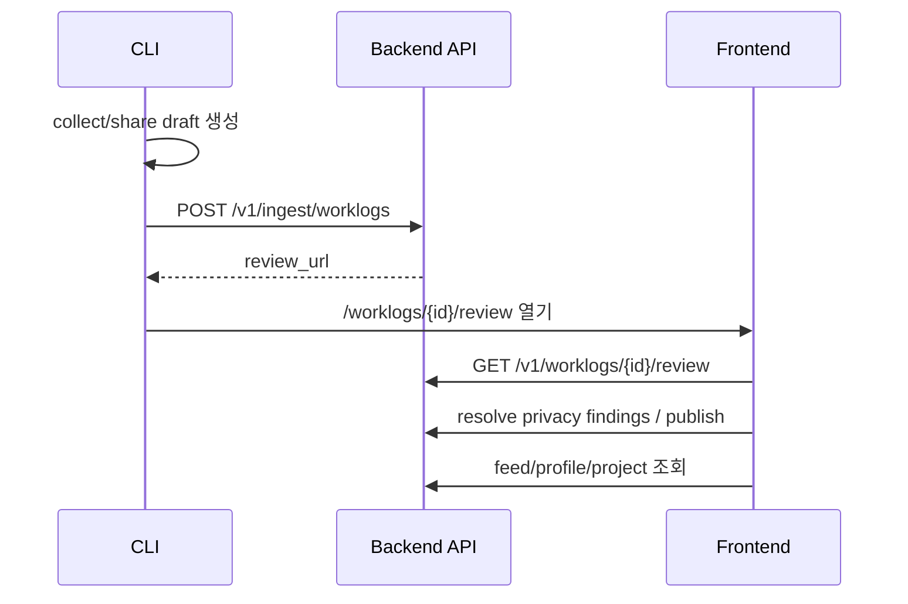

# Integration - CLI Backend Frontend

## End-to-end 흐름

## 계약 기준

> [!important]
> 파라미터 충돌이 있으면 **Database column name → Backend → Frontend → CLI** 순서로 맞춥니다.

## 완료된 큰 축

- review URL route 정합성
- OAuth callback/dashboard route 정합성
- ingest source metadata 보존
- duplicate ingest idempotency
- feed/project/leaderboard/social API mock 제거 및 실 API 연결
- collection window reason review evidence 노출
- review evidence에 `collection_quality` / `collection_sources` 노출
- Linux review URL clipboard fallback 보강
- `share --note`를 `summary` prefix가 아닌 `user_note` 별도 계약으로 승격

## 관련 원본

- [[Cross Repo Integration Fixes#목표 end-to-end 흐름]]
- [[Cross Repo Integration Fixes#P1 — API contract drift 수정]]
- [[Cross Repo Integration Fixes#P2 — 제품 완성도]]

## 남은 검증 리스크

> [!warning]
> Docker daemon이 꺼져 있으면 `make smoke-e2e` 성공 경로는 로컬에서 재검증할 수 없습니다.

- [ ] Docker Desktop 실행 상태에서 `agentfeed-dev`의 `make smoke-e2e` 성공 확인
- [ ] 실제 GitHub OAuth / CLI browser login happy path 재확인
- [ ] 실제 사용자 작업 repo에서 `agentfeed share --open-review` smoke

## 2026-05-30 계약 감사 결과

> [!warning]
> 수집 파트는 model 정보를 이미 draft/share preview에서 보유하지만, 당시 ingest 계약에는 `worklog.model`이 없어 Backend 저장 이후 정보가 사라졌습니다.

P1로 남길 계약 gap:

- CLI: `LocalDraft.worklog.model`은 존재하지만 `IngestWorklogRequest.worklog` / `draftToIngestRequest()`에 model이 없음
- Backend: ingest schema와 저장 경로가 model을 받지 않음
- Frontend: 타입/카드에서 model을 활용할 여지가 있으나 ingest 경로로 저장되지 않으면 표시할 수 없음

> [!todo]
> [[#2026-05-30 worklog.model ingest 계약]]에서 DB/Backend schema 기준으로 정리했습니다.

추가 P2 후보:

- Frontend feed 정렬 라벨 `Most shipped`가 실제 UI에서 `most_discussed`로 매핑되는지 재확인 후 수정
- Backend `/worklogs/{id}/unpublish`를 Frontend review/detail action에 연결할지 제품 정책 결정

## 2026-05-30 worklog.model ingest 계약

> [!success]
> DB column `worklogs.model`을 기준으로 Backend ingest/store/review 응답, CLI upload payload, Frontend review/detail 표시까지 `worklog.model` 계약을 연결했습니다.

- 기준 컬럼: `worklogs.model`
- Backend:
  - `IngestWorklogPayload.model`을 nullable field로 수신
  - `POST /v1/ingest/worklogs`에서 `Worklog.model`에 저장
  - `GET /v1/worklogs/{id}/review`, `GET /v1/worklogs/{id}`, `GET /v1/feed` 응답에서 first-class `model` 유지
- CLI:
  - `LocalDraft.worklog.model`을 `IngestWorklogRequest.worklog.model`로 업로드
  - `null` 허용으로 기존 collector/client와 호환
- Frontend:
  - API adapter가 card/detail model을 보존
  - review **Collection evidence**, review header, public detail header/metrics에서 표시
- Dev smoke:
  - Cursor-style session row의 `model=cursor-agent`가 draft → review API → public detail/feed까지 보존되는지 assertion 추가

> [!note]
> 모델명은 수집된 경우에만 보존하며, collector가 제공하지 않은 값을 추정해서 채우지 않습니다.

## 2026-05-30 E2E smoke gate 보강

> [!info]
> `agentfeed-dev/scripts/smoke-e2e.sh`는 Docker dev stack이 켜진 상태에서 CLI `share --json` → Backend ingest/review → Frontend review route → publish → public feed까지 검증합니다.

- Cursor-style 수집 payload의 `collection_quality=low`, `collection_sources[0].name=cursor` 확인
- `share --note`가 `summary`에 섞이지 않고 `user_note`로 draft/review/detail/feed까지 보존되는지 확인
- 현재 로컬 검증 상태: Docker daemon 미실행으로 syntax/static check만 가능

## 2026-05-30 test-all gate 보강

> [!success]
> Docker daemon이 꺼진 환경에서도 3-repo 통합 회귀를 더 빨리 잡을 수 있도록 `agentfeed-dev/scripts/test-all.sh`에 static smoke gate와 Alembic offline migration chain 검증을 추가했습니다.

- `agentfeed-dev`: `bash -n scripts/smoke-e2e.sh`
- `AgentFeed-CLI`: `npm test -- --run`, `npm run typecheck`
- `agentfeed-frontend`: `npx tsc --noEmit`, `npm run build`
- `agentfeed-backend`: `pytest tests/test_contracts.py`, `alembic upgrade head --sql`
- `uv run`이 생성할 수 있는 미추적 `agentfeed-backend/uv.lock`은 검증 후 자동 정리

> [!note]
> 이 gate는 실제 Docker compose 기동을 대체하지 않습니다. `make smoke-e2e`는 여전히 Docker Desktop 실행 후 별도로 확인해야 합니다.

## 2026-05-30 Review evidence 계약

> [!success]
> Frontend review 페이지는 publish 전 검토 화면에서 수집 신뢰도를 판단할 수 있도록 Backend metrics의 `collection_quality`와 `collection_sources`를 함께 표시합니다.

- 기준 필드: `worklog.metrics.collection_quality`, `worklog.metrics.collection_sources`
- UI 위치: `WorklogReviewPage`의 **Collection evidence**
- 검증: `agentfeed-frontend`에서 `npx tsc --noEmit --pretty false`, `npm run build`

## 2026-05-30 Clipboard fallback 계약

> [!success]
> `agentfeed share` / upload 이후 review URL 전달 UX가 Linux desktop 환경에서도 더 안정적으로 동작하도록 clipboard command fallback을 확장했습니다.

- macOS: `pbcopy`
- WSL: `clip.exe`
- Linux: `xclip` → `wl-copy` → `xsel`
- 검증: `npm test -- tests/clipboard.test.ts --run`, `npm test -- --run`, `npm run build`

## 2026-05-30 user_note 계약

> [!important]
> 사용자가 `agentfeed share --note`로 입력한 공개 메모는 생성 요약(`summary`)에 섞지 않고 DB column `worklogs.user_note`를 기준으로 Backend → Frontend → CLI 계약을 맞춥니다.

- DB 기준 컬럼: `worklogs.user_note`
- Backend:
  - `IngestWorklogPayload.user_note`
  - `WorklogCard.user_note`
  - `WorklogReviewResponse.worklog.user_note`
- CLI:
  - `LocalDraft.worklog.user_note`
  - `IngestWorklogRequest.worklog.user_note`
  - privacy scanner가 `user_note`를 별도 public field로 redaction
- Frontend:
  - `ApiWorklogCard.user_note`
  - adapter의 `Worklog.userNote`
  - review/detail/feed card에서 author note 표시

> [!note]
> 이 결정으로 생성 요약은 수집/분석 결과만 담고, 사람의 맥락은 별도 공개 메모로 다뤄집니다.
