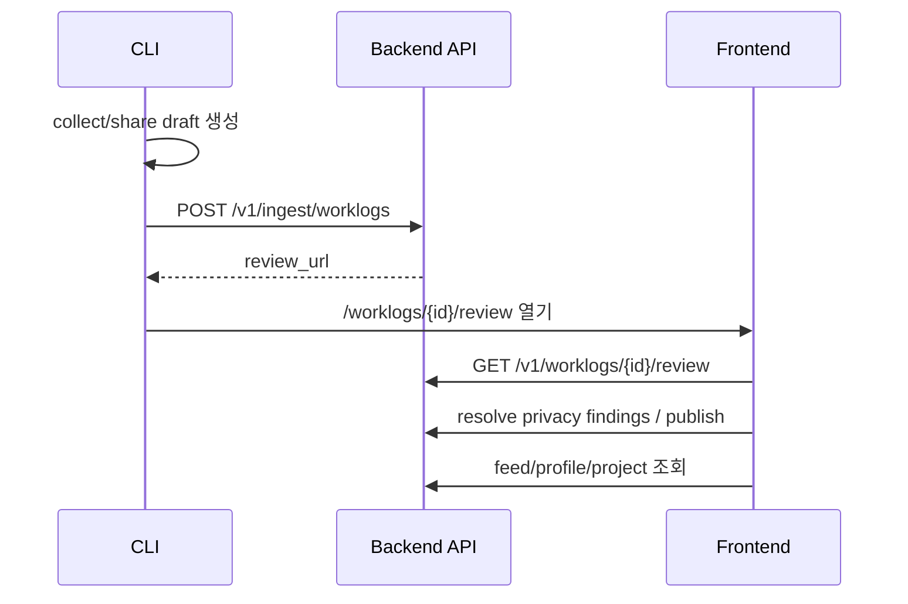

# Integration - CLI Backend Frontend

## End-to-end 흐름

## 계약 기준

> [!important]
> 파라미터 충돌이 있으면 **Database column name → Backend → Frontend → CLI** 순서로 맞춥니다.

## 완료된 큰 축

- review URL route 정합성
- OAuth callback/dashboard route 정합성
- ingest source metadata 보존
- duplicate ingest idempotency
- feed/project/leaderboard/social API mock 제거 및 실 API 연결
- collection window reason review evidence 노출
- review evidence에 `collection_quality` / `collection_sources` 노출
- Linux review URL clipboard fallback 보강
- `share --note`를 `summary` prefix가 아닌 `user_note` 별도 계약으로 승격

## 2026-05-30 Landing placeholder control 제거

> [!success]
> Landing page의 public footer placeholder links와 hero sample card의 inert comment/share controls를 실제 route/action으로 연결했습니다.

수정:

- Landing footer `href="#"` 링크를 `/changelog`, `/privacy`, `/terms`, `/docs`, GitHub URL로 교체했습니다.
- 샘플 worklog comment 버튼은 실제 detail route로 이동합니다.
- 샘플 share 버튼은 Web Share API를 사용하고, 미지원 환경에서는 clipboard copy로 fallback합니다.

검증:

- `npx tsc --noEmit --pretty false`
- `npm run build`

## 2026-05-30 Frontend inert control 제거

> [!success]
> Header notification bell, feed sidebar follow/category buttons, footer placeholder links를 실제 route 또는 API-backed action으로 연결했습니다.

수정:

- Header 알림 버튼 → `/notifications` route 연결
- `/notifications` page 추가: `GET /v1/me/notifications`, 개별 read, all-read, pagination 사용
- Feed Rising builders follow 버튼 → `POST/DELETE /v1/users/{username}/follow` optimistic action 연결
- Feed Hot categories 버튼 → feed category filter 갱신
- Footer `href="#"` 제거 → `/changelog`, `/privacy`, `/terms`, `/docs`, GitHub link 연결
- Changelog/Privacy/Terms/Docs static route 추가

검증:

- `npx tsc --noEmit --pretty false`
- `npm run build`

> [!note]
> Frontend repo에는 아직 별도 test runner dependency가 없으므로, 새 dependency 추가 없이 TypeScript/Next build gate로 검증했습니다.

## 2026-05-30 Backend project_id UUID validation

> [!success]
> string으로 받던 `project_id` 입력을 schema/query validation 단계에서 UUID로 검증해 malformed ID가 router 내부 `uuid.UUID(...)` 변환으로 500을 만들지 않도록 보정했습니다.

문제:

- `POST /v1/worklogs` body의 `project_id`와 `GET /v1/me/worklogs?project_id=...` query는 문자열로 받은 뒤 router 내부에서 `uuid.UUID(...)`를 직접 호출했습니다.
- 잘못된 UUID가 들어오면 FastAPI/Pydantic의 표준 422가 아니라 route 실행 중 예외로 번질 수 있었습니다.

수정:

- `CreateWorklogRequest.project_id`를 `uuid.UUID | None`으로 변경했습니다.
- `get_my_worklogs.project_id` query type을 `uuid.UUID | None`으로 변경했습니다.
- router 내부 수동 UUID 변환을 제거하고 validation된 값을 그대로 사용합니다.

검증:

- invalid `CreateWorklogRequest.project_id` Pydantic validation 회귀 테스트
- `/me/worklogs` handler signature가 FastAPI UUID validation을 사용하는지 회귀 테스트
- `uv run --with pytest --with pytest-asyncio pytest -q`
- `uv run --with ruff ruff check --select I,F app/schemas/worklog.py app/routers/worklogs.py app/routers/me.py tests/test_contracts.py`

## 2026-05-30 CLI API base URL validation

> [!success]
> `agentfeed login/status/share` 등이 사용하는 API base URL을 네트워크 호출 전에 검증하고, trailing slash를 정규화하도록 보정했습니다.

문제:

- `AGENTFEED_API_BASE_URL`, `.env`, 저장 credential, 명시 옵션에서 들어온 URL이 malformed이거나 `ftp://` 같은 잘못된 protocol이어도 그대로 fetch 시점까지 전달될 수 있었습니다.
- 사용자는 `fetch failed` 같은 늦은 오류만 보게 되어 로컬 연결 문제를 파악하기 어려웠습니다.

수정:

- `resolveApiBaseUrl()`이 최종 candidate를 `normalizeApiBaseUrl()`로 검증합니다.
- 허용 protocol은 `http` / `https`입니다.
- hostname 필수, URL 내 credentials 금지, query/hash 금지입니다.
- `/v1/` 같은 trailing slash는 `/v1`로 정규화합니다.

검증:

- malformed URL reject 회귀 테스트
- unsupported protocol reject 회귀 테스트
- query/hash reject 회귀 테스트
- env/file URL normalization 회귀 테스트
- `npx vitest run tests/config.test.ts`
- `npm run typecheck`
- `npm test -- --run`
- `npm run build`

## 2026-05-30 Backend production env fail-fast

> [!success]
> `ENVIRONMENT=production`일 때 Backend가 weak/default secret, localhost OAuth callback/frontend/origin, 누락된 GitHub OAuth 값을 조용히 받아들이지 않도록 fail-fast validation을 추가했습니다.

문제:

- 기존 Backend 설정은 production에서도 기본 `SECRET_KEY`, localhost `GITHUB_REDIRECT_URI`, localhost `FRONTEND_URL`, localhost `ALLOWED_ORIGINS`, 빈 GitHub OAuth 값을 그대로 허용할 수 있었습니다.
- 이 상태로 배포되면 로그인/OAuth flow가 깨지거나 JWT signing secret이 기본값으로 남는 운영 사고가 가능합니다.

수정:

- `Settings` model validation에서 production일 때 다음을 강제합니다.
  - `SECRET_KEY`: 기본값 금지, 최소 32자
  - `GITHUB_CLIENT_ID` / `GITHUB_CLIENT_SECRET`: non-empty
  - `GITHUB_REDIRECT_URI` / `FRONTEND_URL` / `ALLOWED_ORIGINS`: public `https` URL, localhost 금지
- development 기본값은 로컬 구동 편의성을 위해 유지합니다.

검증:

- production secure config accept 회귀 테스트
- default secret reject 회귀 테스트
- localhost OAuth/frontend/origin reject 회귀 테스트
- missing GitHub OAuth value reject 회귀 테스트
- `uv run --with pytest --with pytest-asyncio pytest -q`
- `uv run --with ruff ruff check --select I,F app/config.py tests/test_contracts.py`

## 2026-05-30 Backend provider token at-rest 보호

> [!success]
> Backend GitHub OAuth provider token은 신규 저장/갱신 시 `AuthAccount.access_token_encrypted` 컬럼에 `af1:` prefix가 붙은 encrypted value로 저장합니다.

문제:

- 컬럼명은 `access_token_encrypted`였지만 기존 구현은 GitHub provider token을 그대로 저장했습니다.
- DB snapshot 또는 관리자 실수로 provider token이 노출되면 GitHub OAuth 권한까지 노출될 수 있었습니다.

수정:

- `SECRET_KEY`에서 유도한 Fernet key로 provider token을 암호화합니다.
- 새 auth account 생성과 기존 account token refresh 모두 암호화 경로를 탑니다.
- 기존 plaintext row를 읽을 수 있도록 `af1:` prefix가 없는 값은 legacy plaintext로 취급하는 migration fallback을 유지합니다.

검증:

- provider token round-trip / plaintext 미포함 회귀 테스트
- legacy plaintext fallback 회귀 테스트
- `uv run --with pytest --with pytest-asyncio pytest -q`
- `uv run --with ruff ruff check --select I,F app/services/auth.py tests/test_contracts.py`

> [!warning] 운영 메모
> `SECRET_KEY`가 바뀌면 새 encrypted provider token 복호화가 불가능합니다. 운영에서는 secret rotation 전에 별도 provider-token migration/rotation 절차가 필요합니다.

## 관련 원본

- [[Cross Repo Integration Fixes#목표 end-to-end 흐름]]
- [[Cross Repo Integration Fixes#P1 — API contract drift 수정]]
- [[Cross Repo Integration Fixes#P2 — 제품 완성도]]

## 남은 검증 리스크

> [!success]
> 2026-05-30 현재 Docker dev stack에서 `make smoke-e2e`가 CLI upload → Backend review API → Frontend review route → publish → public detail/feed까지 통과했습니다.

- [x] Docker Desktop 실행 상태에서 `agentfeed-dev`의 `make smoke-e2e` 성공 확인
- [x] CLI → Backend → Frontend review/publish/feed smoke 재확인
- [x] OAuth 없이 재현 가능한 CLI browser-login token exchange 경로 test 보강
- [x] smoke 전용 ingestion token을 `/v1/ingest/status`로 upload 전 검증
- [ ] 실제 GitHub OAuth / CLI browser login happy path 재확인
- [ ] 실제 사용자 작업 repo에서 `agentfeed share --open-review` smoke

## 2026-05-30 계약 감사 결과

> [!warning]
> 수집 파트는 model 정보를 이미 draft/share preview에서 보유하지만, 당시 ingest 계약에는 `worklog.model`이 없어 Backend 저장 이후 정보가 사라졌습니다.

P1로 남길 계약 gap:

- CLI: `LocalDraft.worklog.model`은 존재하지만 `IngestWorklogRequest.worklog` / `draftToIngestRequest()`에 model이 없음
- Backend: ingest schema와 저장 경로가 model을 받지 않음
- Frontend: 타입/카드에서 model을 활용할 여지가 있으나 ingest 경로로 저장되지 않으면 표시할 수 없음

> [!todo]
> [[#2026-05-30 worklog.model ingest 계약]]에서 DB/Backend schema 기준으로 정리했습니다.

추가 P2 후보:

- [x] Frontend feed 정렬 라벨 `Most shipped`가 실제 UI에서 `most_discussed`로 매핑되는지 재확인 후 수정
- [x] Backend `/worklogs/{id}/unpublish`를 Frontend review/detail action에 연결할지 제품 정책 결정

## 2026-05-30 Feed sort label 계약

> [!success]
> Frontend Public Feed의 마지막 sort option은 Backend feed API의 `most_discussed` aggregate sort를 호출하므로 UI 라벨을 `Most shipped`에서 `Most discussed`로 맞췄습니다.

- Backend feed sort 계약: `latest`, `trending`, `most_liked`, `most_discussed`
- Frontend:
  - `FEED_SORT_OPTIONS = Latest / Trending / Most liked / Most discussed`
  - `feedSortParamFromLabel('Most discussed') = 'most_discussed'`
  - `FeedParams.sort`에서 feed용 `most_shipped`를 제거해 leaderboard 용어와 혼동을 줄임

> [!note]
> `most_shipped`는 leaderboard type에서는 계속 사용하지만, public feed sort UI에서는 comment aggregate가 필요한 위치이므로 `Most discussed`가 맞습니다.

## 2026-05-30 Publish management 계약

> [!success]
> Backend에 이미 있던 `POST /v1/worklogs/{id}/unpublish`를 Frontend API wrapper와 review/detail 관리 UX에 연결했습니다.

- Backend 기준:
  - publish: `POST /v1/worklogs/{id}/publish`
  - unpublish: `POST /v1/worklogs/{id}/unpublish`
- Frontend:
  - `worklogs.unpublish(id, 'private')` wrapper 추가
  - review 화면에서 이미 `public`/`unlisted`인 worklog는 **Make private**로 비공개 전환 가능
  - detail 화면에서 author/editor는 **Manage publishing** 버튼으로 review 관리 화면 진입
- 계약 테스트:
  - `worklogs.unpublish` wrapper 존재 확인
  - `public`/`unlisted`만 unpublish control 대상이고 `needs_review/private` draft는 제외

> [!note]
> 직접 삭제가 아니라 visibility/status를 private로 되돌리는 reversible publish 관리 액션으로 취급합니다.

## 2026-05-30 worklog.model ingest 계약

> [!success]
> DB column `worklogs.model`을 기준으로 Backend ingest/store/review 응답, CLI upload payload, Frontend review/detail 표시까지 `worklog.model` 계약을 연결했습니다.

- 기준 컬럼: `worklogs.model`
- Backend:
  - `IngestWorklogPayload.model`을 nullable field로 수신
  - `POST /v1/ingest/worklogs`에서 `Worklog.model`에 저장
  - `GET /v1/worklogs/{id}/review`, `GET /v1/worklogs/{id}`, `GET /v1/feed` 응답에서 first-class `model` 유지
- CLI:
  - `LocalDraft.worklog.model`을 `IngestWorklogRequest.worklog.model`로 업로드
  - `null` 허용으로 기존 collector/client와 호환
- Frontend:
  - API adapter가 card/detail model을 보존
  - review **Collection evidence**, review header, public detail header/metrics에서 표시
- Dev smoke:
  - Cursor-style session row의 `model=cursor-agent`가 draft → review API → public detail/feed까지 보존되는지 assertion 추가

> [!note]
> 모델명은 수집된 경우에만 보존하며, collector가 제공하지 않은 값을 추정해서 채우지 않습니다.

## 2026-05-30 E2E smoke gate 보강

> [!info]
> `agentfeed-dev/scripts/smoke-e2e.sh`는 Docker dev stack이 켜진 상태에서 CLI `share --json` → Backend ingest/review → Frontend review route → publish → public feed까지 검증합니다.

- Cursor-style 수집 payload의 `collection_quality=low`, `collection_sources[0].name=cursor` 확인
- `share --note`가 `summary`에 섞이지 않고 `user_note`로 draft/review/detail/feed까지 보존되는지 확인
- 현재 로컬 검증 상태: [[#2026-05-30 Docker smoke E2E 성공]]에서 실제 Docker smoke 통과

## 2026-05-30 Docker smoke E2E 성공

> [!success]
> `agentfeed-dev`에서 `make smoke-e2e`가 통과했습니다. 이 경로는 CLI가 만든 draft를 Backend에 업로드하고, Frontend review 화면에서 조회한 뒤 publish하여 public detail/feed까지 확인합니다.

검증 경로:

1. Docker compose dev stack health check
2. smoke 전용 user / ingestion token seed
3. `AgentFeed-CLI` local build
4. temporary Cursor-style project 생성
5. `agentfeed share --json --source cursor --session-file ... --note ... --all --no-clipboard`
6. `GET /v1/worklogs/{id}/review`
7. `GET /worklogs/{id}/review`
8. `POST /v1/worklogs/{id}/publish`
9. `GET /v1/worklogs/{id}` + `GET /v1/feed?agent=cursor`

추가 보정:

- `agentfeed-dev/compose.yaml`의 Frontend service에 `frontend-next:/workspace/frontend/.next` named volume을 추가했습니다.
- 이유: host의 `npm run build`와 Docker dev server가 같은 bind mount의 `.next`를 공유하면 Next dev manifest가 깨져 500이 발생할 수 있습니다.
- `node_modules`와 마찬가지로 container-owned volatile cache는 named volume으로 격리합니다.

검증:

- `curl -fsS -L http://localhost:3001`
- `make smoke-e2e`

## 2026-05-30 share --json upload draft 계약

> [!success]
> `agentfeed share --json`의 upload mode도 dry-run mode처럼 `draft` 객체를 함께 출력합니다. smoke script와 외부 자동화는 upload 결과(`upload`)와 실제 수집 draft(`draft`)를 한 JSON에서 검증할 수 있습니다.

계약:

- dry-run: `{ dry_run: true, reused_existing_draft, draft }`
- upload: `{ dry_run: false, reused_existing_draft, draft_id, draft, upload }`

이유:

- smoke gate는 `share --note`가 `summary`에 섞이지 않고 `draft.worklog.user_note`에 남는지 확인해야 합니다.
- Backend 응답만으로는 CLI가 어떤 draft를 업로드했는지 로컬 수집 계약을 검증하기 어렵습니다.
- JSON output은 터미널/자동화용 로컬 결과이므로, 이미 `.agentfeed/drafts/*.json`에 저장되는 public-safe draft를 함께 보여주는 쪽이 재현성이 높습니다.

검증:

- `tests/cli-share.test.ts`
- `make smoke-e2e`

## 2026-05-30 Feed time_range 계약

> [!success]
> Frontend feed의 시간 필터가 더 이상 UI-only 상태가 아니며 Backend `GET /v1/feed?time_range=...` 필터로 전달됩니다.

계약:

| UI label | Backend query |
| --- | --- |
| `오늘` | `time_range=today` |
| `이번 주` | `time_range=week` |
| `이번 달` | `time_range=month` |
| `전체` | `time_range=all` |

Backend:

- `today`: 최근 24시간
- `week`: 최근 7일
- `month`: 최근 30일
- `all` 또는 알 수 없는 값: 시간 필터 없음

검증:

- `agentfeed-backend/tests/test_contracts.py::test_feed_time_range_filter_maps_known_public_feed_options`
- `agentfeed-frontend/src/lib/api-contract.test.ts`
- `agentfeed-dev/scripts/smoke-e2e.sh`의 public feed 조회가 `time_range=week`를 포함
- `npx tsc --noEmit --pretty false`

## 2026-05-30 Leaderboard streak 계약

> [!success]
> profile stats와 leaderboard `longest_streak`에서 distinct active days proxy를 제거하고 실제 consecutive-day streak 계산으로 교체했습니다.

계약:

- `current_streak_days`: UTC publish day 기준, 오늘 또는 어제부터 이어지는 연속 public worklog day 수
- `longest_streak`: 선택된 leaderboard period 안에서 author별 가장 긴 연속 public worklog day 수
- 같은 날짜에 여러 worklog가 있어도 streak day는 1일로 계산

검증:

- current streak yesterday grace 테스트
- longest streak이 단순 distinct day count가 아니라 consecutive day count임을 검증
- leaderboard streak ranking helper 테스트

## 2026-05-30 Release/dev reproducibility 계약

> [!success]
> CLI release metadata와 local dev bootstrap을 상용 운영에 더 가깝게 정리했습니다.

CLI:

- `package.json` version을 `src/version.ts`가 읽고 `agentfeed doctor`와 draft `source.tool_version`이 같은 값을 사용합니다.
- `agentfeed-cli/<package version>` 포맷은 유지합니다.

Dev:

- `agentfeed-dev/scripts/cli-link.sh`: `npm install` → `npm ci`
- `agentfeed-dev/scripts/dev-native.sh`: `.env` 우선, 없으면 `.env.example` fallback
- `agentfeed-dev/scripts/dev-native.sh` / `compose.yaml`: Frontend dependency install은 lockfile 기반 `npm ci`
- `scripts/test-all.sh`에서 shell syntax와 reproducibility guard를 확인합니다.

## 2026-05-30 test-all gate 보강

> [!success]
> Docker daemon이 꺼진 환경에서도 3-repo 통합 회귀를 더 빨리 잡을 수 있도록 `agentfeed-dev/scripts/test-all.sh`에 static smoke gate와 Alembic offline migration chain 검증을 추가했습니다.

- `agentfeed-dev`: `bash -n scripts/smoke-e2e.sh`
- `AgentFeed-CLI`: `npm test -- --run`, `npm run typecheck`
- `agentfeed-frontend`: `npx tsc --noEmit`, `npm run build`
- `agentfeed-backend`: `pytest tests/test_contracts.py`, `alembic upgrade head --sql`
- `uv run`이 생성할 수 있는 미추적 `agentfeed-backend/uv.lock`은 검증 후 자동 정리

> [!note]
> 이 gate는 실제 Docker compose 기동을 대체하지 않습니다. `make smoke-e2e`는 여전히 Docker Desktop 실행 후 별도로 확인해야 합니다.

## 2026-05-30 Review evidence 계약

> [!success]
> Frontend review 페이지는 publish 전 검토 화면에서 수집 신뢰도를 판단할 수 있도록 Backend metrics의 `collection_quality`와 `collection_sources`를 함께 표시합니다.

- 기준 필드: `worklog.metrics.collection_quality`, `worklog.metrics.collection_sources`
- UI 위치: `WorklogReviewPage`의 **Collection evidence**
- 검증: `agentfeed-frontend`에서 `npx tsc --noEmit --pretty false`, `npm run build`

## 2026-05-30 Clipboard fallback 계약

> [!success]
> `agentfeed share` / upload 이후 review URL 전달 UX가 Linux desktop 환경에서도 더 안정적으로 동작하도록 clipboard command fallback을 확장했습니다.

- macOS: `pbcopy`
- WSL: `clip.exe`
- Linux: `xclip` → `wl-copy` → `xsel`
- 검증: `npm test -- tests/clipboard.test.ts --run`, `npm test -- --run`, `npm run build`

## 2026-05-30 user_note 계약

> [!important]
> 사용자가 `agentfeed share --note`로 입력한 공개 메모는 생성 요약(`summary`)에 섞지 않고 DB column `worklogs.user_note`를 기준으로 Backend → Frontend → CLI 계약을 맞춥니다.

- DB 기준 컬럼: `worklogs.user_note`
- Backend:
  - `IngestWorklogPayload.user_note`
  - `WorklogCard.user_note`
  - `WorklogReviewResponse.worklog.user_note`
- CLI:
  - `LocalDraft.worklog.user_note`
  - `IngestWorklogRequest.worklog.user_note`
  - privacy scanner가 `user_note`를 별도 public field로 redaction
- Frontend:
  - `ApiWorklogCard.user_note`
  - adapter의 `Worklog.userNote`
  - review/detail/feed card에서 author note 표시

> [!note]
> 이 결정으로 생성 요약은 수집/분석 결과만 담고, 사람의 맥락은 별도 공개 메모로 다뤄집니다.

## 2026-05-30 Search UI/API 계약

> [!success]
> Frontend Header의 검색 입력이 더 이상 장식용이 아니며, `GET /v1/search` 계약을 사용하는 `/search` 페이지로 연결됩니다.

계약:

- Header search form: `/search?q={query}`로 이동
- Search page: `q`와 `type` query string을 읽어 Backend `/search` 호출
- 지원 type: `worklogs`, `users`, `projects`, `prompts`
- `type`이 없으면 Backend 기본 all 검색 결과를 섹션별로 표시

Frontend 표시:

- Worklogs: 기존 `WorklogCard`와 social state hydration 재사용
- Users: `ApiUser` → `User` adapter 후 profile link
- Projects: Backend search가 제공하는 최소 project field를 기준으로 card 표시, `slug`가 없으면 `id` fallback
- Prompts: worklog detail link로 연결

검증:

- `agentfeed-frontend`: `npx tsc --noEmit --pretty false`
- `agentfeed-frontend`: `npm run build`에서 `/search` route 생성 확인
- `agentfeed-dev`: `./scripts/test-all.sh`

## 2026-05-30 Cursor pagination UX 계약

> [!success]
> Frontend에서 list API의 첫 페이지만 읽어 발생하던 truncation과 project false 404 위험을 줄였습니다.

보강 범위:

- `ProjectsPage`: `projects.list({ cursor, limit })` 기반 Load more
- `ProfilePage`: `users.worklogs(username, { cursor, limit })` 기반 Worklogs tab Load more
- `ProjectDetailPage`: `projects.list`를 cursor로 순회해 slug/id를 찾고, 첫 페이지 밖 project를 404로 오판하지 않음
- `ProjectDetailPage`: `projects.worklogs(projectId, { cursor, limit })` 기반 Load more

> [!note]
> Backend column/API 이름을 기준으로 유지했고, Frontend는 기존 `pagination.next_cursor` / `pagination.has_more` 계약을 그대로 사용합니다.

검증:

- `agentfeed-frontend`: `npx tsc --noEmit --pretty false`
- `agentfeed-frontend`: `npm run build`
- `agentfeed-dev`: `./scripts/test-all.sh`

## 2026-05-30 CLI login/token smoke 계약

> [!success]
> 실제 GitHub OAuth credential 없이도 CLI browser login의 핵심 token exchange/save 경로를 자동 검증합니다.

계약:

- `browserLogin({ noOpen: true })`는 브라우저를 열지 않고 CLI auth session을 생성합니다.
- CLI session 생성 request는 64 hex verifier와 device name을 보냅니다.
- exchange request는 같은 verifier로 session token을 교환합니다.
- 성공 시 `~/.agentfeed/credentials.json`에 `ingestion_token`, `api_base_url`, `user`가 저장됩니다.
- `agentfeed-dev/scripts/smoke-e2e.sh`는 upload 전에 seed ingestion token을 `GET /v1/ingest/status`로 검증합니다.

남은 수동 확인:

- [ ] 실제 GitHub OAuth app credential이 있는 환경에서 `/cli/authorize` approval UI까지 포함한 browser-login happy path

검증:

- `AgentFeed-CLI`: `npx vitest run tests/api-hook.test.ts`
- `AgentFeed-CLI`: `npm run typecheck`
- `agentfeed-dev`: `bash -n scripts/smoke-e2e.sh`
- `agentfeed-dev`: `make smoke-e2e`
