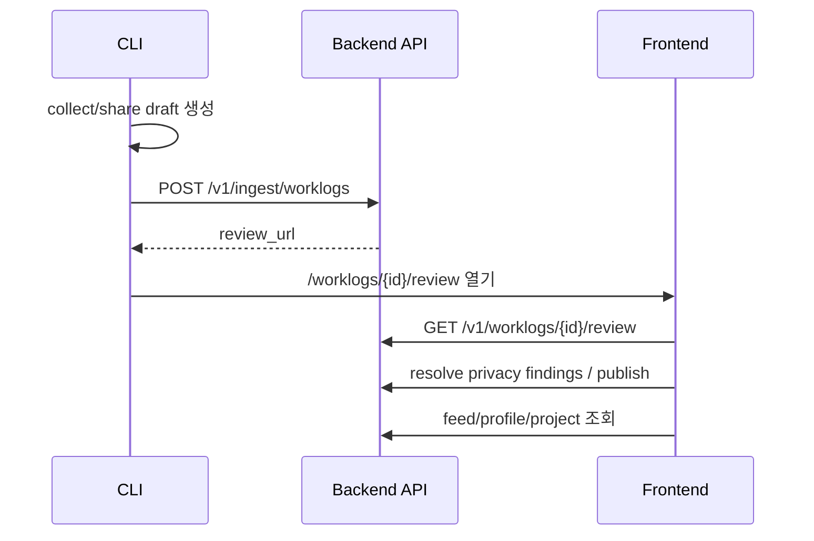

# Integration - CLI Backend Frontend

## End-to-end 흐름

## 계약 기준

> [!important]
> 파라미터 충돌이 있으면 **Database column name → Backend → Frontend → CLI** 순서로 맞춥니다.

## 완료된 큰 축

- review URL route 정합성
- OAuth callback/dashboard route 정합성
- ingest source metadata 보존
- duplicate ingest idempotency
- feed/project/leaderboard/social API mock 제거 및 실 API 연결
- collection window reason review evidence 노출
- review evidence에 `collection_quality` / `collection_sources` 노출
- Linux review URL clipboard fallback 보강
- `share --note`를 `summary` prefix가 아닌 `user_note` 별도 계약으로 승격

## 관련 원본

- [[Cross Repo Integration Fixes#목표 end-to-end 흐름]]
- [[Cross Repo Integration Fixes#P1 — API contract drift 수정]]
- [[Cross Repo Integration Fixes#P2 — 제품 완성도]]

## 남은 검증 리스크

> [!warning]
> Docker daemon이 꺼져 있으면 `make smoke-e2e` 성공 경로는 로컬에서 재검증할 수 없습니다.

- [ ] Docker Desktop 실행 상태에서 `agentfeed-dev`의 `make smoke-e2e` 성공 확인
- [ ] 실제 GitHub OAuth / CLI browser login happy path 재확인
- [ ] 실제 사용자 작업 repo에서 `agentfeed share --open-review` smoke

## 2026-05-30 Review evidence 계약

> [!success]
> Frontend review 페이지는 publish 전 검토 화면에서 수집 신뢰도를 판단할 수 있도록 Backend metrics의 `collection_quality`와 `collection_sources`를 함께 표시합니다.

- 기준 필드: `worklog.metrics.collection_quality`, `worklog.metrics.collection_sources`
- UI 위치: `WorklogReviewPage`의 **Collection evidence**
- 검증: `agentfeed-frontend`에서 `npx tsc --noEmit --pretty false`, `npm run build`

## 2026-05-30 Clipboard fallback 계약

> [!success]
> `agentfeed share` / upload 이후 review URL 전달 UX가 Linux desktop 환경에서도 더 안정적으로 동작하도록 clipboard command fallback을 확장했습니다.

- macOS: `pbcopy`
- WSL: `clip.exe`
- Linux: `xclip` → `wl-copy` → `xsel`
- 검증: `npm test -- tests/clipboard.test.ts --run`, `npm test -- --run`, `npm run build`

## 2026-05-30 user_note 계약

> [!important]
> 사용자가 `agentfeed share --note`로 입력한 공개 메모는 생성 요약(`summary`)에 섞지 않고 DB column `worklogs.user_note`를 기준으로 Backend → Frontend → CLI 계약을 맞춥니다.

- DB 기준 컬럼: `worklogs.user_note`
- Backend:
  - `IngestWorklogPayload.user_note`
  - `WorklogCard.user_note`
  - `WorklogReviewResponse.worklog.user_note`
- CLI:
  - `LocalDraft.worklog.user_note`
  - `IngestWorklogRequest.worklog.user_note`
  - privacy scanner가 `user_note`를 별도 public field로 redaction
- Frontend:
  - `ApiWorklogCard.user_note`
  - adapter의 `Worklog.userNote`
  - review/detail/feed card에서 author note 표시

> [!note]
> 이 결정으로 생성 요약은 수집/분석 결과만 담고, 사람의 맥락은 별도 공개 메모로 다뤄집니다.
