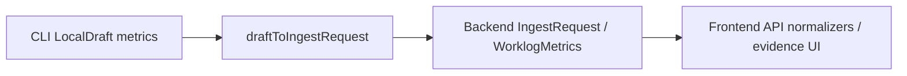

# Ingestion Evidence Contract Guard 2026-06-11

> [!summary]
> CLI draft evidence validation now fails closed on unsupported `worklog.metrics` fields before publish. This keeps the CLI payload aligned with Backend Pydantic `extra="forbid"` schemas and Frontend strict evidence renderers.

## Why

The cross-repo audit checked the path:



Existing Backend and Frontend contracts already reject unexpected nested evidence fields such as raw session payloads. The CLI draft reader validated field types and limits, but `metrics`, `agent_metrics[]`, and `collection_sources[]` could silently drop unknown nested keys while reconstructing a draft.

## Change

- Added a reusable CLI draft validator primitive: `rejectUnexpectedKeys`.
- Made local draft validation reject unsupported keys in:
  - `worklog.metrics`
  - `worklog.metrics.agent_metrics[]`
  - `worklog.metrics.collection_sources[]`
- Added regression coverage for:
  - unsupported aggregate metric field (`raw_tokens`)
  - unsupported per-agent raw field (`raw_session`)
  - unsupported per-agent `commits_created` (aggregate-only by contract)
  - unsupported collection-source raw field (`raw_path`)

> [!important]
> `commits_created` remains an aggregate worklog metric only. Per-agent rows keep activity fields such as `tokens_used`, `commands_run`, `tool_calls`, `agent_turns`, and `agent_modes`.

## Verification

```bash
# CLI
npm run build && npm test
# result: 37 test files passed, 613 tests passed

# Backend contract slice
uv run pytest \
  tests/test_ingestion_payload_contracts.py \
  tests/test_ingestion_cli_contracts.py \
  tests/test_worklog_response_model_contracts.py \
  tests/test_worklog_schema_contracts.py \
  tests/test_worklog_card_frontend_contracts.py
# result: 17 passed

# Frontend contract slice
npm run lint && npm test
# result: tsc --noEmit passed, contract tests passed
```

## File-size review

| File | Pure LOC | Status |
| --- | ---: | --- |
| `src/draft/validation.ts` | 224 | Warning band, still under 250 |
| `src/draft/validation-primitives.ts` | 245 | Warning band, split before next non-trivial addition |
| `tests/draft-validation.test.ts` | 130 | Healthy |

> [!warning]
> `src/draft/validation-primitives.ts` is now close to the 250 pure-LOC ceiling. The next validation primitive addition should split enum/domain validators from primitive shape validators first.

## Follow-up

- [ ] Continue enterprise-hardening with another cross-repo contract slice.
- [ ] If CLI validation primitives need more behavior, split `src/draft/validation-primitives.ts` before adding lines.
- [ ] Keep Backend schema as source of truth for metric-field availability, then align CLI and Frontend.
